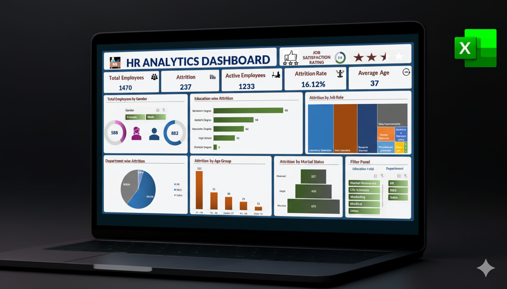

# Blinkit Sales Analytics Dashboard  

---

  
  

---

## 📑 Table of Contents

- [Project Summary](#project-summary)  
- [Business Objectives](#business-objectives)  
- [Tools & Skills Used](#tools--skills-used)  
- [Project Structure](#project-structure)  
- [How to Explore This Repo](#how-to-explore-this-repo)  
- [Dashboard Preview](#dashboard-preview)  
- [Dashboard Features](#dashboard-features)  
- [Key Insights Delivered](#key-insights-delivered)  
- [Skills Demonstrated](#skills-demonstrated)  
- [How This Adds Value](#how-this-adds-value)  
- [Next Steps](#next-steps)  
- [Author & Contact](#author--contact)

---

## 📊 Project Summary

This project presents an **interactive and dynamic sales analytics dashboard** for **Blinkit**, a leading Indian quick-commerce grocery delivery platform owned by Zomato. Built entirely in **Microsoft Excel**, the dashboard allows stakeholders to explore sales performance metrics, uncover business insights, and make data-driven decisions.  

The dashboard was developed using a provided dataset that simulates real-world sales scenarios, enabling the demonstration of **end-to-end dashboard creation**, from raw data cleaning to KPI calculation and visualization.  

---

## 🎯 Business Objectives

The key objectives were to analyze Blinkit's sales performance across multiple dimensions:

- **Key Performance Indicators (KPIs):**
  - **Total Sales:** Overall revenue generated  
  - **Average Sales:** Average revenue per order  
  - **Number of Items:** Total items sold  
  - **Average Rating:** Customer satisfaction across products  

- **Sales Performance by Dimensions (Visualizations):**
  - Total Sales by **Fat Content** (Donut Chart)  
  - Total Sales by **Item Type** (Bar Chart)  
  - Fat Content by **Outlet**  
  - Total Sales by **Outlet Establishment Year** (Line Chart)  
  - Sales by **Outlet Size**  
  - Sales by **Outlet Location** (Funnel Chart)  
  - Metrics by **Outlet Type** (Supermarket, Grocery Store)  

---

## 🛠️ Tools & Skills Used

- **Microsoft Excel (2021 or later):** PivotTables, Slicers, Charts (Donut, Bar, Line, Funnel)  
- **Data Preparation:** Cleaning, transforming, and standardizing raw sales data  
- **Advanced Excel Formulas & Calculated Fields** for KPIs  
- **Data Visualization & Dashboard Design:** Interactive charts, slicers, action buttons  
- **Best Practices:** Consistent naming, structured sheets, maintainable dashboard layout  

---

## 📂 Project Structure

| Folder/File Name                                      | Description                                                   |
|-------------------------------------------------------|---------------------------------------------------------------|
| `data/Blinkit_Grocery_Raw_Data_Set.xlsx`             | Raw sales dataset for analysis                                 |
| `data/Blinkit_Sales_Analysis_Portifolio_version.xlsx`| Cleaned and transformed dataset ready for PivotTables         |
| `screenshots/Project_thumbnail.png`                  | Thumbnail image used for project documentation               |
| `screenshots/Blinkit_Dashboard_Screenshot.png`      | Screenshot of the final interactive dashboard                |

---

## 🔎 How to Explore This Repo

1. Preview the **project thumbnail** to get an initial visual overview.  
2. View the **dashboard screenshot** to see interactive charts and KPIs.  
3. Open the **raw and cleaned datasets** to inspect data preparation and transformations.  
4. Explore the **Excel dashboard file** to interact with KPIs, slicers, and visualizations.

---

## 🖥️ Dashboard Preview

---

### 🖥️ Live Dashboard Preview View the interactive Excel dashboard (read-only) on OneDrive: [Click here to open the dashboard](https://1drv.ms/x/c/2bb7e29997cf6540/EcnQVf865NZBktHX1pn8JdIBRI7SVY8kRrbbg344YtHyQQ?e=t40y2n)

### 🧭 Dashboard Features

- **KPIs:** Total Sales, Average Sales, Number of Items, Average Ratings  
- **Interactive Visualizations:**  
  - Donut Charts for **Fat Content & Outlet Size**  
  - Bar Charts for **Item Type & Outlet Type Metrics**  
  - Line Chart for **Outlet Establishment Year**  
  - Funnel Chart for **Outlet Location (Tier 1/2/3)**  
- **Slicer Integration:** Filter by **Item Type, Outlet Type, Size, Location**  
- **Dynamic Layout:** Hyperlinks and action buttons for easy navigation between sheets  

---

## 📈 Key Insights Delivered

- Overall sales performance summarized through KPIs  
- Sales trends by product type, fat content, and outlet characteristics  
- Identification of high-performing and underperforming segments  
- Geographical discrepancies in sales across Tier 1, 2, and 3 cities  
- Enables **deep-dive analysis** with interactive slicers  

---

## 🧩 Skills Demonstrated

- Data cleaning and preparation for accurate reporting  
- Advanced PivotTable and calculated field creation  
- Interactive dashboard design and data visualization  
- Problem-solving and Excel automation techniques  
- Business acumen in translating sales requirements into actionable insights  

---

## 🚀 How This Adds Value

- Empowers **data-driven decision-making** for Blinkit stakeholders  
- Improves operational efficiency by highlighting sales trends and gaps  
- Promotes **self-service analytics** for non-technical users  
- Provides a foundation for scaling the analysis to **Power BI, Tableau, or SQL-based solutions**  

---

## 🔗 Next Steps

- Migrate the dashboard to **Power BI** or **Tableau** for enhanced interactivity  
- Integrate **SQL databases** for real-time data analysis  
- Incorporate **forecasting models** to predict future sales trends  
- Expand analysis to customer satisfaction drivers and inventory efficiency  

---

## 👤 Author & Contact

**Author:** Saideep Pallela  
**Completed:** September 2025  
**Portfolio Repo:** [Explore-My-Microsoft-Excel-Projects](https://github.com/saideeppallela/Explore-My-Microsoft-Excel-Projects)  
**Email:** [saideeppallela@gmail.com](mailto:saideeppallela@gmail.com)  
**LinkedIn:** [linkedin.com/in/saideeppallela](https://www.linkedin.com/in/saideeppallela/)
