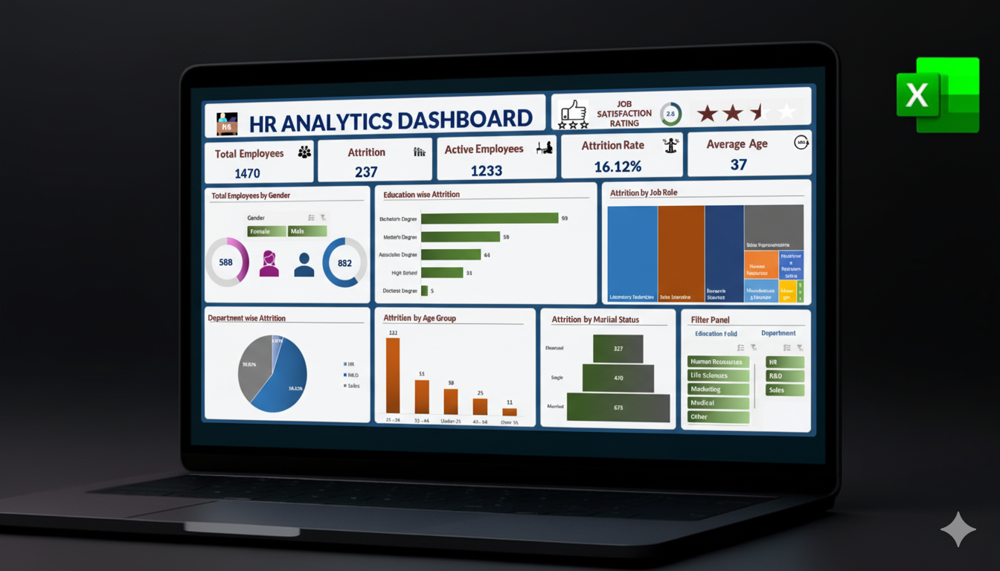
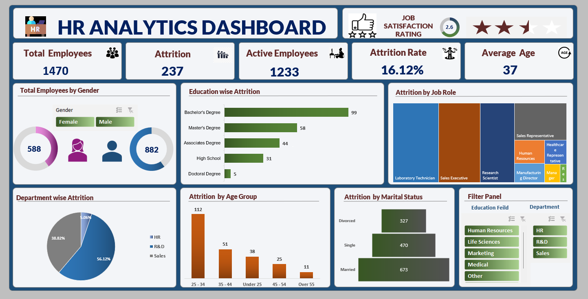

# HR Analytics Dashboard  
  

---

  
  

---

## 📑 Table of Contents

- [Project Summary](#project-summary)
- [Business Objectives](#business-objectives)
- [Tools & Skills Used](#tools--skills-used)
- [Project Structure](#project-structure)
- [How to Explore This Repo](#how-to-explore-this-repo)
- [Dashboard Preview](#dashboard-preview)
- [Dashboard Features](#dashboard-features)
- [Key Insights Delivered](#key-insights-delivered)
- [Skills Demonstrated](#skills-demonstrated)
- [How This Adds Value](#how-this-adds-value)
- [Next Steps](#next-steps)
- [Author & Contact](#author--contact)

---

## 📊 Project Summary

This end-to-end, interactive HR Analytics dashboard built in **Microsoft Excel** empowers HR teams and business leaders with dynamic, visually compelling insights into employee demographics and attrition patterns. The project demonstrates transforming raw HR data into executive-ready analytics using advanced Excel functionality and design best practices.

---

## 🎯 Business Objectives

- Visualize workforce composition and attrition by **gender, education, department, age group, and marital status**
- Identify high-risk segments to enable targeted **employee retention strategies**
- Deliver a **single-page, filter-enabled dashboard** for rapid decision-making
- Convert HR data into an actionable, easy-to-understand analytic tool

---

## 🛠️ Tools & Skills Used

- Microsoft Excel: Pivot Tables, Slicers, Donut, Bar, Treemap, Funnel, Pie, and Column Charts
- Dynamic Formulas: `IFERROR`, percentage calculations, absolute and relative references
- Data Cleaning & Transformation for analysis readiness
- Business Intelligence & Dashboard Design best practices
- Data Storytelling tailored for HR insights

---

## 📂 Project Structure

| Folder/File Name                                      | Description                                    |
|-------------------------------------------------------|-----------------------------------------------|
| `data/HR Analytics Raw Data Set.xlsx`                 | Raw anonymized HR dataset (dummy data)        |
| `data/HR Analytics - Portfolio Version.xlsx`          | Cleaned & transformed dataset for analysis    |
| `screenshots/Project_Thumbnail.png`                   | Project thumbnail used across documentation   |
| `screenshots/HR_Analytics_Dashboard_Screenshot.png`   | Final dashboard screenshot for demo            |

---

## 🔎 How to Explore This Repo

1. Preview the project with the **thumbnail image** to understand its theme.
2. View the **dashboard screenshot** to get a clear picture of the interactive elements and design.
3. Open and inspect the **raw and processed datasets** to understand data structure.
4. Review this README for detailed insights on methodology and impact.

---

## 🖥️ Dashboard Preview

---

### 🖥️ Live Dashboard Preview
View the interactive Excel dashboard (read-only) on OneDrive:  
[Click here to open the dashboard](https://1drv.ms/x/c/2bb7e29997cf6540/ERkVWr0w17NJlWsOQvvJYtcBhwIOkJHd42KUStMttmEB-A?e=1Trpbl)

---

## 🧭 Dashboard Features

- **KPIs & Questions:** Attrition rate, job satisfaction, employee headcount segmented by demographics
- **Six Key Visualizations:**
    - **Dual Donut Charts:** Gender distribution with dynamic counts and icons embedded in charts  
    - **Horizontal Bar Chart:** Education-wise attrition sorted for easy interpretation  
    - **Treemap:** Attrition by job role, dynamically extracted for full slicer interactivity  
    - **Pie Chart:** Department attrition percentage shares with clear labels  
    - **Column Chart:** Attrition by age group highlighting at-risk demographics  
    - **Funnel Chart:** Marital status attrition visualized with gradient fills  
- **Slicer Integration:** Gender, Education Field, and Department slicers drive full dashboard interactivity  
- **Design & Usability:** Grouped chart elements, consistent color palette, manual slicer headers for clarity, clean and minimalistic UI  

---

## 📈 Key Insights Delivered

- Pinpointed employee groups with highest attrition risk by multiple demographic factors  
- Enabled HR professionals to quickly detect and focus retention efforts where necessary  
- Provided a live, fully interactive dashboard that updates instantly as filters change  

---

## 🧩 Skills Demonstrated

- Advanced use of Excel Analytics features for real-time business intelligence  
- Crafting error-proof dynamic formulas for robust slicer-driven calculations  
- Data storytelling through engaging and clean visual dashboard design  
- Overcoming Excel limitations by creative data extraction for treemaps and funnels  
- Translating complex HR data into clear, actionable insights

---

## 🚀 How This Adds Value

- Demonstrates proficiency in Excel as a BI and analytics platform for HR use cases  
- Shows ability to build interactive dashboards that drive decision-making  
- Exhibits skill in business problem framing, technical solutioning, and data storytelling  
- Highlights best practices in UX design for professional dashboards

---

## 🔗 Next Steps

- Create scalable versions of this dashboard in **Power BI** or **Tableau**  
- Integrate **predictive modeling** for attrition risk using Python or R  
- Implement **automation** with Excel VBA for report generation  
- Perform deeper segmentation by tenure, region, and employee level  

---

## 👤 Author & Contact

**Author:** Saideep Pallela  
**Completed:** September 2025  
**Portfolio Repo:** [Explore-My-Microsoft-Excel-Projects](https://github.com/saideeppallela/Explore-My-Microsoft-Excel-Projects)  
**Email:** [saideeppallela@gmail.com](mailto:saideeppallela@gmail.com)  
**LinkedIn:** [linkedin.com/in/saideeppallela](https://www.linkedin.com/in/saideeppallela/)

---
